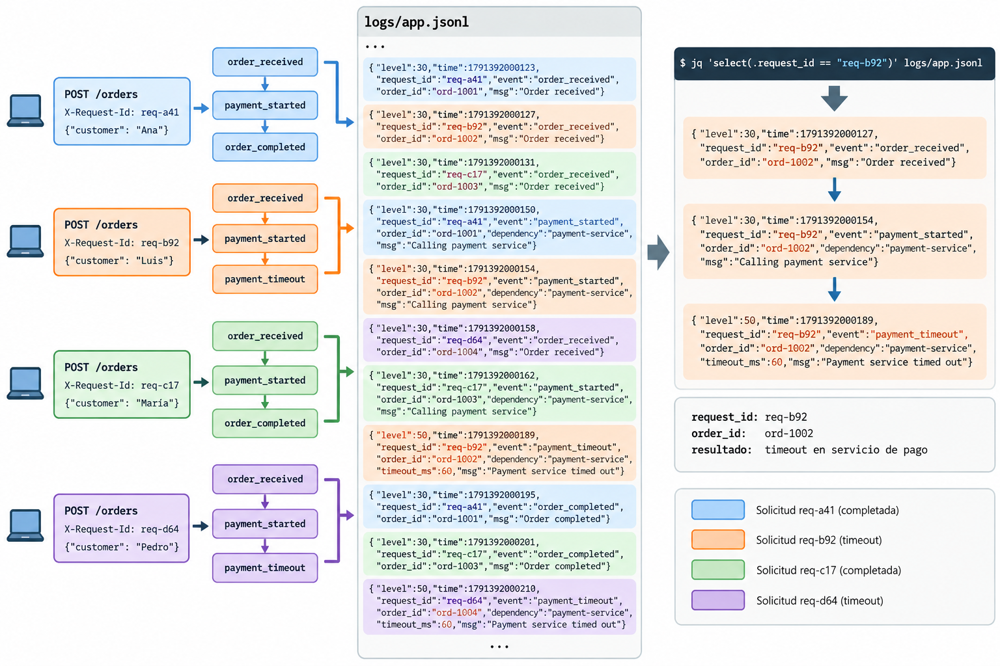
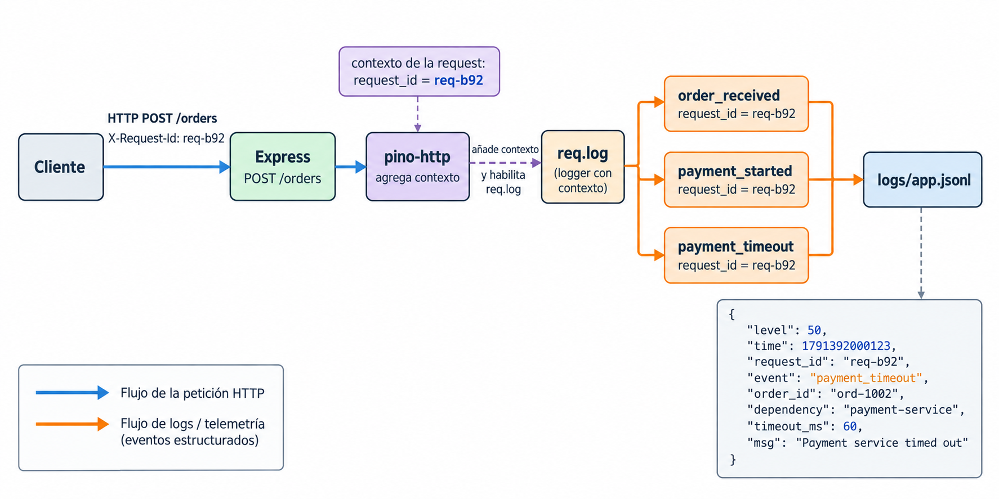

<!--
Requiere en MkDocs Material:
- admonition
- attr_list
- md_in_html
- pymdownx.details
- pymdownx.superfences
- pymdownx.tabbed con alternate_style: true
-->

# 3.2 Logging estructurado

## Objetivos de aprendizaje

Al finalizar esta clase se espera que el estudiante pueda:

- explicar qué información aporta un log como fuente de evidencia operacional;
- diseñar eventos estructurados con nombres estables y campos de contexto pertinentes;
- correlacionar eventos de una solicitud mediante `request_id` y distinguirlo de identificadores de dominio como `order_id`;
- asignar niveles de logging de acuerdo con el significado operacional del evento;
- reconocer información que no debe persistirse en logs;
- consultar logs JSON con `jq` y reconocer los límites de las conclusiones que pueden obtenerse.

!!! question "Pregunta central"

    **¿Qué información debe contener un log para poder reconstruir qué ocurrió durante una solicitud concreta?**

## 1. Logs como fuente de evidencia

Un log registra un evento observado durante la ejecución de un sistema. Puede representar la recepción de una solicitud, el inicio o finalización de una operación, la respuesta de una dependencia, un cambio de estado, una condición anómala o un error.

Su utilidad no depende únicamente de que el mensaje sea legible. Depende de las preguntas que puedan responderse posteriormente con la evidencia conservada.

Considérese la siguiente salida:

```text
Order received
Calling payment
Payment failed
Request failed
```

Puede inferirse que ocurrió un fallo relacionado con pagos. Sin embargo, la evidencia no permite establecer qué solicitud produjo el fallo, qué orden estaba siendo procesada, cuál fue la condición concreta ni qué parámetros eran relevantes en ese momento.

El problema se vuelve más evidente cuando existen solicitudes concurrentes:

```text
Order received
Order received
Calling payment
Order received
Calling payment
Payment failed
Calling payment
Request completed
Payment failed
```

El orden de las líneas ya no representa una única secuencia de ejecución.

!!! abstract "Criterio"

    Producir más líneas de log no garantiza mejor evidencia. La utilidad depende de la **estructura**, el **contexto**, la **correlación** y la posibilidad de formular consultas sobre los datos producidos.

## 2. Mensajes y eventos estructurados

Un mensaje textual concentra la información en una cadena:

```js
req.log.error(`Payment failed for order ${orderId}`);
```

El resultado puede ser legible:

```text
Payment failed for order ord-1002
```

pero la estructura debe reconstruirse posteriormente a partir del texto.

Un evento estructurado mantiene los datos como campos independientes:

```js
req.log.error({
  event: "payment_failed",
  order_id: orderId,
  dependency: "payment-service"
});
```

Una representación JSON podría ser:

```json
{
  "level": 50,
  "time": 1791392000123,
  "event": "payment_failed",
  "order_id": "ord-1002",
  "dependency": "payment-service"
}
```

Ahora pueden realizarse consultas sobre propiedades explícitas como `event`, `order_id` o `dependency` sin analizar el contenido de una frase.

### 2.1 El mensaje no desaparece

La estructura y el mensaje cumplen funciones diferentes:

```js
req.log.error(
  {
    event: "payment_timeout",
    order_id: orderId,
    timeout_ms: 800
  },
  "Payment service timed out"
);
```

En este ejemplo:

```text
event = "payment_timeout"
```

es un nombre estable apropiado para consulta y análisis automatizado, mientras:

```text
msg = "Payment service timed out"
```

es una representación destinada principalmente a lectura humana.

!!! note "Regla de diseño"

    No conviene utilizar el texto del mensaje como si fuera el identificador estable del evento. El texto puede cambiar por razones editoriales sin que cambie el hecho representado.

## 3. Campos y contexto

Un evento debe conservar el contexto necesario para interpretarlo.

Considérese:

```json
{
  "event": "payment_timeout"
}
```

El evento identifica una situación, pero deja preguntas abiertas: ¿a qué solicitud pertenece?, ¿qué orden estaba siendo procesada?, ¿qué dependencia produjo el timeout?, ¿cuál era el límite configurado?

Una representación con mayor contexto puede ser:

```json
{
  "event": "payment_timeout",
  "request_id": "req-b92",
  "order_id": "ord-1002",
  "dependency": "payment-service",
  "timeout_ms": 800
}
```

La incorporación de un campo debe poder justificarse por una necesidad de interpretación, correlación o búsqueda. Registrar todos los valores disponibles no constituye una estrategia adecuada de instrumentación.

!!! example "De la pregunta a la evidencia"

    | Pregunta operacional | Evidencia necesaria |
    |---|---|
    | ¿Qué solicitud produjo el evento? | `request_id` |
    | ¿Qué orden estaba siendo procesada? | `order_id` |
    | ¿Qué ocurrió? | `event` |
    | ¿Qué dependencia estaba implicada? | `dependency` |
    | ¿Qué límite se había configurado? | `timeout_ms` |

## 4. Identificación y correlación

### 4.1 `request_id`

Un `request_id` identifica una solicitud o interacción técnica concreta.

Por ejemplo:

```text
req-b92
```

Todos los eventos asociados con esa solicitud pueden conservar el mismo identificador:

```json
{"event":"order_received","request_id":"req-b92"}
{"event":"payment_started","request_id":"req-b92"}
{"event":"payment_timeout","request_id":"req-b92"}
```

Aunque los eventos de varias solicitudes aparezcan intercalados:

```json
{"event":"order_received","request_id":"req-a41"}
{"event":"order_received","request_id":"req-b92"}
{"event":"payment_started","request_id":"req-a41"}
{"event":"order_received","request_id":"req-c17"}
{"event":"payment_started","request_id":"req-b92"}
{"event":"payment_timeout","request_id":"req-b92"}
```

<figure markdown="span">
  
  <figcaption>
    Figura 2. Las solicitudes concurrentes producen eventos intercalados en el archivo de logs; el <code>request_id</code> permite seleccionar y reconstruir la secuencia correspondiente a una solicitud concreta.
  </figcaption>
</figure>

puede reconstruirse una operación filtrando por el identificador:

```text
jq 'select(.request_id == "req-b92")' logs/app.jsonl
```

### 4.2 `order_id`

`order_id` identifica una entidad del dominio:

```text
ord-1002
```

No cumple la misma función que `request_id`.

Una orden podría participar en solicitudes distintas:

```text
req-b92 -> POST /orders       -> ord-1002
req-k18 -> GET /orders/1002   -> ord-1002
req-p31 -> PUT /orders/1002   -> ord-1002
```

Por tanto:

- `request_id` permite correlacionar eventos de una interacción técnica;
- `order_id` permite relacionar eventos con una entidad del dominio.

Ambos pueden ser útiles simultáneamente.

## 5. Logging HTTP con Express y Pino

La práctica utiliza Express, Pino, `pino-http` y `jq`.

`pino-http` se incorpora como middleware de Express y expone un logger asociado con cada solicitud mediante `req.log`. La configuración de la práctica genera un identificador de solicitud y lo conserva en el contexto del logger:

```js
app.use(
  pinoHttp({
    logger,
    autoLogging: false,
    quietReqLogger: true,
    customAttributeKeys: {
      reqId: "request_id"
    },
    genReqId(req, res) {
      const incoming = req.headers["x-request-id"];
      const requestId =
        typeof incoming === "string" && incoming.length > 0
          ? incoming
          : randomUUID();

      res.setHeader("x-request-id", requestId);
      return requestId;
    }
  })
);
```

A partir de ese momento, los eventos emitidos mediante:

```js
req.log.info(...)
req.log.warn(...)
req.log.error(...)
```

quedan asociados con la solicitud correspondiente.

<figure markdown="span">
  
  <figcaption>
    Figura 1. <code>pino-http</code> incorpora el contexto de la solicitud y habilita <code>req.log</code>; los eventos producidos por el handler conservan el mismo <code>request_id</code> antes de almacenarse en <code>logs/app.jsonl</code>.
  </figcaption>
</figure>

!!! info "Alcance de la práctica"

    La actividad no requiere modificar esta configuración. El objetivo es diseñar los eventos producidos por `src/orders.js`, utilizando el contexto que la infraestructura ya proporciona.

## 6. Niveles y semántica de eventos

Los niveles representan la severidad operacional del evento.

| Nivel | Uso orientativo |
|---|---|
| `INFO` | Operación normal que conviene conservar como evidencia |
| `WARN` | Condición anómala o degradada que no impide necesariamente completar la operación |
| `ERROR` | Fallo que impide completar una operación o produce un resultado incorrecto |

Por ejemplo:

```text
order_received       INFO
payment_started      INFO
payment_retry        WARN
payment_timeout      ERROR
order_completed      INFO
```

La misma categoría de evento debe conservar una semántica consistente entre ejecuciones.

!!! question "Criterio para asignar el nivel"

    Si un primer intento de pago falla pero un reintento automático permite completar la operación, ¿el primer fallo debe representar necesariamente un `ERROR`?

    La respuesta depende del significado operacional definido para el sistema. El nivel no debe elegirse únicamente porque apareció una excepción o porque el desarrollador desea observar el evento.

## 7. Timestamps y orden temporal

Pino incorpora un timestamp en cada registro. El timestamp permite ubicar temporalmente un evento, pero no resuelve por sí solo la reconstrucción de operaciones concurrentes.

Pueden existir eventos con muy poca separación temporal, logs intercalados de varias solicitudes y diferencias entre el orden de producción, transporte y almacenamiento de la telemetría.

Por esta razón, el timestamp debe combinarse con contexto de correlación.

```text
jq 'select(.request_id == "req-b92")' logs/app.jsonl
```

permite seleccionar primero una solicitud concreta y analizar después la secuencia de sus eventos.

!!! warning "Límite de interpretación"

    Reconstruir que `payment_timeout` ocurrió después de `payment_started` no demuestra por qué `payment-service` produjo el timeout. Los logs de `orders-api` describen lo observado desde ese servicio. Una explicación causal del componente externo requeriría evidencia adicional.

## 8. Información sensible

Que un dato esté disponible durante la ejecución no implica que deba persistirse en un log.

Entre los datos que requieren especial cuidado se encuentran contraseñas, tokens de autenticación, claves API, cookies, cabeceras de autorización, números completos de tarjetas y datos personales que no sean necesarios para el objetivo operacional.

El siguiente evento es inadecuado:

```json
{
  "event": "payment_started",
  "customer_email": "student@example.test",
  "payment_token": "tok_demo_1002"
}
```

La práctica incluye deliberadamente estos campos en las solicitudes para comprobar que no aparezcan en los logs.

!!! danger "Minimización"

    Que un valor exista en `req.body` no justifica registrarlo. La instrumentación debe conservar únicamente la información necesaria para las preguntas operacionales que se pretende responder.

## 9. Consulta de logs JSON con `jq`

Los logs de la práctica se almacenan como JSON Lines:

```text
logs/app.jsonl
```

Cada línea contiene un objeto JSON independiente.

### 9.1 Seleccionar una solicitud

```text
jq 'select(.request_id == "req-b92")' logs/app.jsonl
```

### 9.2 Seleccionar un tipo de evento

```text
jq 'select(.event == "payment_timeout")' logs/app.jsonl
```

### 9.3 Seleccionar errores

Pino representa los niveles mediante valores numéricos. En esta práctica, los eventos de nivel `ERROR` pueden seleccionarse con:

```text
jq 'select(.level >= 50)' logs/app.jsonl
```

### 9.4 Extraer campos

```text
jq -r '[.request_id, .order_id, .event] | @tsv' logs/app.jsonl
```

Estas consultas son suficientes para la práctica. `jq` se utiliza como medio para inspeccionar la evidencia producida, no como un contenido adicional que deba dominarse en profundidad.

## 10. Práctica guiada

El repositorio utilizado en clase contiene un servicio `orders-api` con instrumentación deliberadamente deficiente.

[Repositorio de práctica](https://github.com/guillermocalderon2021/metricas-software-3.2-logging){ .md-button .md-button--primary }

Durante la actividad se modifica únicamente `src/orders.js`. Los scripts de soporte no requieren cambios.

```text
metricas-software-3.2-logging/
├── src/
│   ├── server.js
│   └── orders.js
├── scripts/
│   ├── check-sensitive.js
│   ├── doctor.js
│   ├── evidence.js
│   ├── exercise.js
│   ├── show-evidence.js
│   └── show-logs.js
├── logs/
├── ACTIVIDAD.md
├── package.json
└── README.md
```

### 10.1 Preparación del entorno

La práctica puede realizarse desde Linux, macOS o Windows. En Windows se utiliza PowerShell. No se requiere WSL.

Compruebe primero:

```text
git --version
node --version
npm --version
jq --version
```

El repositorio requiere Node.js 22 o posterior.

#### Instalación de `jq`

=== "Linux: Ubuntu o Debian"

    ```text
    sudo apt-get update
    sudo apt-get install jq
    ```

=== "macOS"

    Con Homebrew:

    ```text
    brew install jq
    ```

=== "Windows PowerShell"

    Con WinGet:

    ```text
    winget install jqlang.jq
    ```

    Después de instalarlo, cierre y abra PowerShell si `jq` todavía no aparece en `PATH`.

Clone el repositorio:

```text
git clone https://github.com/guillermocalderon2021/metricas-software-3.2-logging.git
cd metricas-software-3.2-logging
```

Instale las dependencias y verifique el entorno:

```text
npm install
npm run doctor
```

!!! success "Resultado esperado"

    La comprobación debe terminar con:

    ```text
    Entorno listo para la actividad.
    ```

    Si aparece algún `FAIL`, debe corregirse antes de continuar.

### 10.2 Ejecución del escenario inicial

Ejecute:

```text
npm run exercise
```

El script inicia `orders-api`, genera cuatro solicitudes concurrentes, utiliza identificadores conocidos, produce dos operaciones normales y dos timeouts, almacena stdout en `logs/app.jsonl` y finaliza el servicio.

| `request_id` | `order_id` | Escenario | Resultado HTTP esperado |
|---|---|---|---:|
| `req-a41` | `ord-1001` | normal | 201 |
| `req-b92` | `ord-1002` | `payment-timeout` | 504 |
| `req-c17` | `ord-1003` | normal | 201 |
| `req-d64` | `ord-1004` | `payment-timeout` | 504 |

Visualice una muestra:

```text
npm run logs:sample
```

Después puede inspeccionar el archivo completo:

```text
jq '.' logs/app.jsonl
```

### 10.3 Diagnóstico de la instrumentación inicial

La versión inicial de `src/orders.js` registra el cuerpo de la solicitud:

```js
req.log.info(
  {
    body: {
      order_id,
      scenario,
      customer_email,
      payment_token
    }
  },
  "Order received"
);
```

y produce otros registros únicamente textuales:

```js
req.log.info("Calling payment");
req.log.error("Payment failed");
req.log.info("Done");
```

!!! question "Antes de modificar el código"

    Determine qué preguntas pueden responderse con esta evidencia y cuáles no. Considere, al menos, la solicitud afectada, la orden, el tipo de evento, la dependencia y el timeout.

Ejecute:

```text
npm run check:sensitive
npm run evidence
npm run evidence:show
```

!!! warning "Resultado inicial"

    En el estado inicial es esperable obtener validaciones `FAIL`. No representa un error del repositorio. Constituye evidencia de que la instrumentación todavía es insuficiente.

### 10.4 Transformación guiada

La corrección se realiza sobre `src/orders.js`.

El primer registro debe evolucionar hacia un evento con nombre estable y contexto de dominio:

```js
req.log.info(
  {
    event: "order_received",
    order_id
  },
  "Order received"
);
```

La invocación de pago debe representar un evento explícito:

```js
req.log.info(
  {
    event: "payment_started",
    order_id,
    dependency: "payment-service"
  },
  "Payment started"
);
```

El timeout debe conservar los datos necesarios para interpretarlo:

```js
const timeoutMs = 60;
await delay(timeoutMs);

req.log.error(
  {
    event: "payment_timeout",
    order_id,
    dependency: "payment-service",
    timeout_ms: timeoutMs
  },
  "Payment service timed out"
);
```

Una operación normal debe finalizar con:

```js
req.log.info(
  {
    event: "order_completed",
    order_id
  },
  "Order completed"
);
```

Durante esta transformación, `customer_email` y `payment_token` no deben persistirse en los registros.

## 11. Actividad individual

!!! info "Distribución del tiempo"

    Se reservan aproximadamente **20 minutos de trabajo** y **10 minutos para validación y entrega**.

!!! danger "Archivo que puede modificarse"

    Durante la actividad se modifica únicamente:

    ```text
    src/orders.js
    ```

    No deben modificarse `src/server.js` ni los archivos del directorio `scripts/`.

### 11.1 Resultado requerido

La instrumentación debe permitir:

1. identificar los eventos de una solicitud mediante `request_id`;
2. identificar la orden mediante `order_id`;
3. distinguir `order_received`, `payment_started`, `payment_timeout` y `order_completed`;
4. identificar `payment-service` como dependencia cuando corresponda;
5. conservar `timeout_ms` en `payment_timeout`;
6. utilizar niveles coherentes;
7. evitar que `customer_email` y `payment_token` aparezcan en los logs.

No deben cambiarse los valores de `request_id`, `order_id` ni `scenario` generados por el ejercicio, ni eliminarse escenarios para satisfacer la validación.

### 11.2 Ejecución

Después de modificar `src/orders.js`:

```text
npm run exercise
```

!!! success "Comprobación"

    Debe generarse nuevamente:

    ```text
    logs/app.jsonl
    ```

Compruebe los nombres de evento:

```text
jq -r 'select(.event != null) | .event' logs/app.jsonl
```

Deben aparecer:

```text
order_received
payment_started
payment_timeout
order_completed
```

### 11.3 Investigación

Utilice `jq` para responder las preguntas siguientes.

**¿Qué ocurrió con `req-b92`?**

```text
jq 'select(.request_id == "req-b92")' logs/app.jsonl
```

Debe ser posible identificar `order_received`, `payment_started` y `payment_timeout`.

**¿Qué orden corresponde a `req-b92`?**

La evidencia debe permitir identificar `ord-1002`.

**¿Qué solicitudes terminaron con `payment_timeout`?**

```text
jq 'select(.event == "payment_timeout")' logs/app.jsonl
```

Deben aparecer `req-b92` y `req-d64`.

**¿Qué evento precedió al timeout de `req-b92`?**

La secuencia debe poder reconstruirse sin recurrir al código fuente.

**¿Se persistió información sensible?**

```text
npm run check:sensitive
```

!!! success "Resultado esperado"

    ```text
    OK: no se detectó información sensible de la práctica.
    ```

## 12. Generación y entrega de evidencia

Ejecute:

```text
npm run evidence
```

Se generará:

```text
evidencia.txt
```

El archivo contiene los eventos asociados con `req-b92`, los eventos `payment_timeout`, un resumen de nombres de evento y validaciones automáticas sobre estructura, contexto e información sensible.

Revise el resultado:

```text
npm run evidence:show
```

!!! success "Actividad completada"

    La actividad está completa cuando aparece:

    ```text
    RESULTADO: EVIDENCIA COMPLETA
    ```

!!! warning "Si la validación falla"

    Si aparece:

    ```text
    RESULTADO: REVISAR INSTRUMENTACIÓN
    ```

    revise las validaciones marcadas como `FAIL`, modifique únicamente `src/orders.js` y repita:

    ```text
    npm run exercise
    npm run evidence
    npm run evidence:show
    ```

### Entrega

Suba únicamente:

```text
evidencia.txt
```

No es necesario entregar `node_modules`, `logs/app.jsonl`, capturas de pantalla ni un archivo ZIP del proyecto.

## 13. Criterios de revisión de logging

| Criterio | Pregunta |
|---|---|
| Evento | ¿El registro representa un hecho identificable? |
| Estructura | ¿La información relevante está disponible como campos? |
| Contexto | ¿Existen los atributos necesarios para interpretar el evento? |
| Correlación | ¿Pueden reconstruirse los eventos de una misma solicitud? |
| Semántica | ¿El nombre del evento mantiene un significado estable? |
| Nivel | ¿La severidad corresponde con el efecto operacional? |
| Temporalidad | ¿Existe información suficiente para ordenar y relacionar eventos? |
| Privacidad | ¿Se evita persistir información sensible innecesaria? |
| Consulta | ¿Las preguntas operacionales pueden expresarse sobre los datos producidos? |

Un conjunto de logs es útil cuando permite reconstruir hechos relevantes con una interpretación defendible. La cantidad de registros producidos no sustituye la estructura, el contexto ni la correlación.

!!! abstract "Relación con el diseño de telemetría"

    La instrumentación puede analizarse mediante la secuencia:

    ```text
    pregunta -> evidencia -> interpretación -> límite de la evidencia
    ```

    En esta práctica, los logs permiten establecer que una solicitud experimentó un timeout de pago y reconstruir los eventos observados por `orders-api`. No permiten determinar por sí solos la causa interna de `payment-service`.

## Referencias

- Express. [*Using middleware*](https://expressjs.com/en/guide/using-middleware.html). Documentación oficial.
- Pino. [*Pino documentation*](https://getpino.io/). Documentación oficial.
- Pino HTTP. [*pino-http*](https://github.com/pinojs/pino-http). Documentación oficial.
- `jq`. [*jq Manual*](https://jqlang.org/manual/). Documentación oficial.
