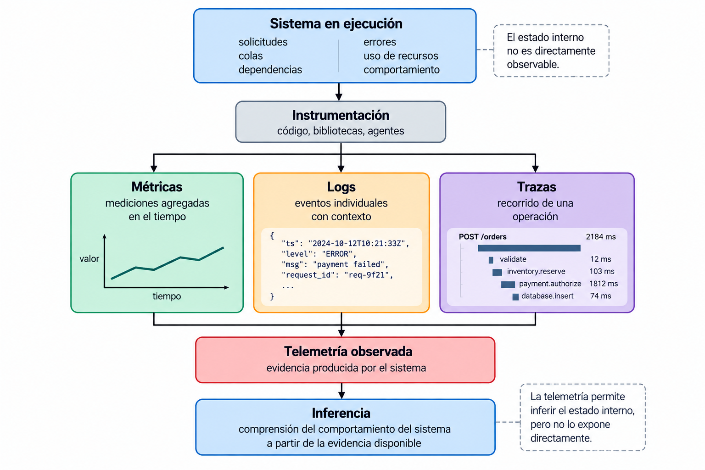
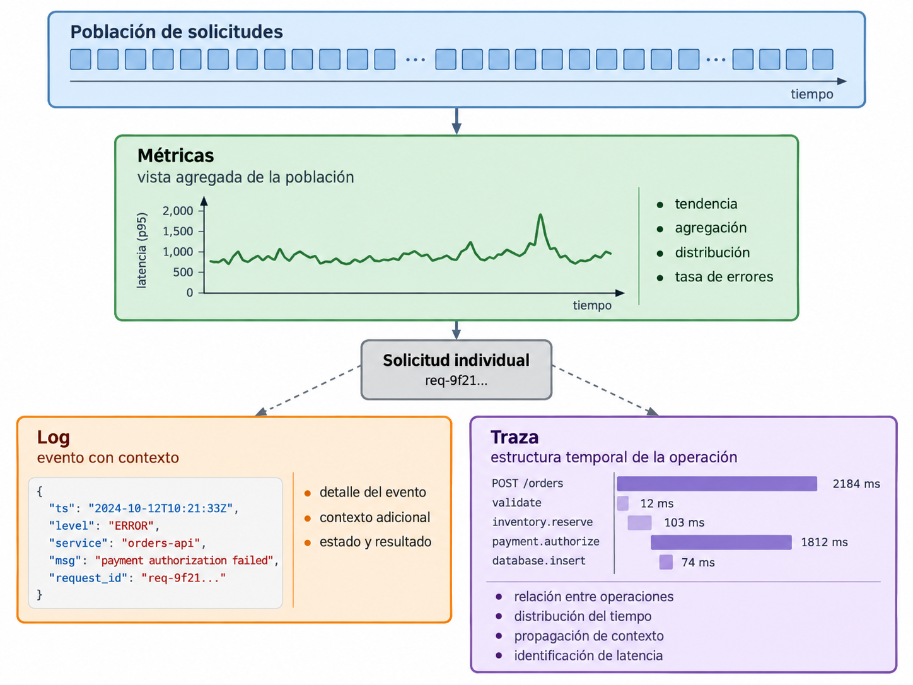
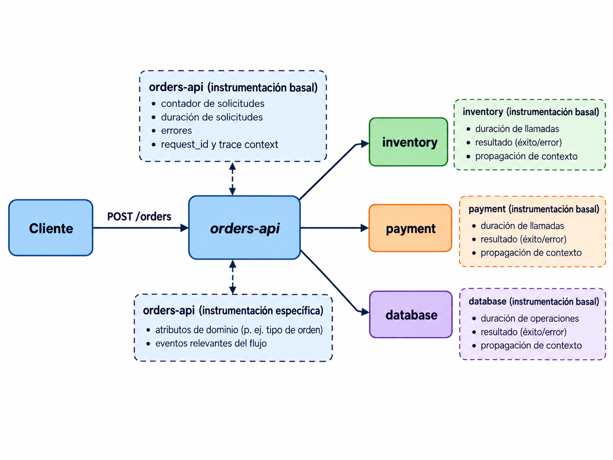

# 3.1 Observabilidad y diseño de telemetría

## Objetivos de aprendizaje

Al finalizar esta clase se espera que el estudiante pueda:

- distinguir monitoreo, observabilidad, telemetría e instrumentación;
- identificar qué información aportan logs, métricas y trazas;
- formular preguntas operacionales antes de seleccionar señales;
- proponer un esquema básico de instrumentación para un servicio;
- reconocer el efecto de la cardinalidad sobre el volumen y el costo de la telemetría;
- determinar qué conclusiones son posibles con la evidencia disponible y qué información adicional sería necesaria.

## 1. Observación de sistemas en ejecución

Un sistema de software en ejecución posee estado interno que no es directamente visible desde el exterior. Entre otros elementos, ese estado incluye solicitudes activas, colas, conexiones, operaciones en curso, errores y dependencias.

El análisis operacional requiere **evidencia observable** que permita inferir aspectos de ese estado.

La evidencia puede provenir de distintas fuentes:

- estado expuesto por el sistema operativo;
- eventos registrados por la aplicación;
- mediciones agregadas durante el tiempo;
- información sobre la ejecución de una operación a través de uno o varios componentes;
- estado reportado por dependencias externas.

La observación no elimina la incertidumbre. Una señal permite realizar determinadas inferencias y deja otras sin resolver.

### Ejemplo

Considérese un servicio HTTP que presenta un aumento del tiempo de respuesta.

La afirmación:

> «La latencia aumentó porque la base de datos está lenta».

contiene una explicación causal. Una serie temporal del percentil 95 de latencia del servicio puede demostrar que existe un aumento, pero no identifica por sí sola la causa.

Para evaluar la explicación pueden ser necesarias otras evidencias:

- duración de operaciones hacia la base de datos;
- cantidad de conexiones disponibles y ocupadas;
- errores o timeouts;
- tiempo consumido en otras dependencias;
- uso de CPU y memoria;
- distribución temporal de las operaciones lentas.

El tipo de evidencia requerida depende de la pregunta que se intenta responder.

## 2. Monitoreo, observabilidad, telemetría e instrumentación

Estos términos describen conceptos relacionados, pero no equivalentes.

### 2.1 Monitoreo

El **monitoreo** consiste en observar de forma sistemática condiciones o variables de un sistema para detectar estados relevantes, estudiar tendencias o verificar objetivos operacionales.

Ejemplos:

- verificar si un endpoint responde;
- observar la tasa de errores;
- comprobar si el uso de memoria supera un umbral;
- evaluar si un SLI se mantiene dentro del objetivo definido;
- comparar el comportamiento actual con un período anterior.

El monitoreo suele partir de preguntas conocidas y condiciones que pueden expresarse con anticipación, aunque también proporciona evidencia útil para investigaciones posteriores. Su alcance no se limita a alertas ni a umbrales predefinidos.

### 2.2 Observabilidad

La **observabilidad** describe la capacidad de comprender el estado y el comportamiento interno de un sistema a partir de la evidencia que este expone.

No es una herramienta ni un producto. Es una propiedad práctica del sistema y de su instrumentación: determina qué preguntas pueden investigarse con la evidencia disponible.

Un sistema con abundante telemetría puede seguir siendo difícil de investigar si esa telemetría carece del contexto, cobertura o nivel de detalle necesarios.

El monitoreo puede utilizar la observabilidad disponible para responder preguntas conocidas, detectar cambios y orientar investigaciones. Ambos conceptos se relacionan, pero no designan la misma actividad.

### 2.3 Telemetría

La **telemetría** es la información producida o recopilada sobre el comportamiento de un sistema durante su ejecución.

Entre las señales más utilizadas se encuentran métricas, logs y trazas. Cada una representa el sistema con una resolución y una estructura diferentes.

### 2.4 Instrumentación

La **instrumentación** es el mecanismo mediante el cual una aplicación o su entorno produce la evidencia necesaria.

Puede realizarse:

- en el código de la aplicación;
- mediante bibliotecas y frameworks;
- en proxies o sidecars;
- en el runtime;
- en el sistema operativo;
- mediante instrumentación automática.

Conviene distinguir dos niveles.

**Instrumentación basal.** Señales generales que describen el funcionamiento ordinario del servicio, por ejemplo cantidad de solicitudes, errores, duración y consumo de recursos relevantes.

**Instrumentación específica.** Señales, atributos o eventos incorporados para investigar preguntas concretas o comportamientos particulares.

Un servicio necesita una base de instrumentación que describa su comportamiento general. La incorporación de nuevas señales, dimensiones o eventos debe justificarse por las preguntas que se pretende responder y por el costo de producir y conservar esa evidencia.


<figure markdown="span">
  
  <figcaption>Figura 1. Relación entre sistema en ejecución, instrumentación, telemetría observada e inferencia.</figcaption>
</figure>

## 3. Logs, métricas y trazas

Las tres señales se complementan, pero no proporcionan el mismo tipo de evidencia.

| Señal | Unidad de análisis típica | Aporta principalmente | Limitación característica |
|---|---|---|---|
| Métrica | población observada durante un intervalo | tasas, tendencias, agregaciones y distribuciones | pierde detalle de observaciones individuales |
| Log | evento individual | contexto detallado sobre lo ocurrido | no representa necesariamente la estructura temporal completa de una operación |
| Traza | ejecución de una operación | relaciones entre operaciones, dependencias y distribución del tiempo | una traza individual no caracteriza por sí sola a toda la población |

Estas características describen usos típicos y no constituyen fronteras absolutas. La representación concreta depende del sistema de instrumentación y del backend utilizado.

La selección de una señal debe responder a la pregunta que se intenta resolver.


<figure markdown="span">
  
  <figcaption>Figura 2. Diferente resolución de las señales: las métricas resumen poblaciones, mientras logs y trazas permiten analizar ejecuciones concretas.</figcaption>
</figure>

## 4. Diseño de telemetría a partir de preguntas operacionales

Una pregunta operacional debe relacionarse con un comportamiento observable y definir con suficiente precisión qué evidencia sería pertinente.

Conviene identificar:

1. el objeto de observación;
2. el comportamiento que interesa estudiar;
3. la población o conjunto de operaciones relevante;
4. el intervalo temporal cuando sea necesario;
5. el criterio con el que se interpretará la evidencia;
6. la decisión que podría sustentarse con el resultado.

### Ejemplos

| Pregunta | Evidencia mínima plausible |
|---|---|
| ¿Qué proporción de solicitudes termina con error? | conteo de solicitudes por resultado |
| ¿Cómo se distribuye la latencia de `POST /orders`? | distribución de duración por operación |
| ¿Qué solicitudes fallidas corresponden al mismo intento de compra? | eventos con identificador de correlación |
| ¿En qué componente se consume el tiempo de una solicitud lenta? | contexto propagado y duración por operación |
| ¿El problema afecta a todos los clientes o a un subconjunto? | dimensión que permita segmentar la evidencia, si su recolección es justificable |

Una señal es pertinente cuando proporciona evidencia necesaria para responder una pregunta operacional o sustentar una decisión definida.

## 5. Caso de estudio: observación de `POST /orders`

Considérese un servicio que procesa la creación de órdenes:

```text
cliente
   |
   v
POST /orders
   |
   +--> validación
   |
   +--> servicio de inventario
   |
   +--> servicio de pagos
   |
   +--> persistencia
```

<figure markdown="span">
  
  <figcaption>Figura 3. Servicio de órdenes y puntos de instrumentación basal y específica utilizados en el caso de estudio.</figcaption>
</figure>

Durante un intervalo determinado se observa un aumento de latencia.

### 5.1 Pregunta inicial: ¿ha aumentado la latencia?

Una señal agregada puede mostrar el comportamiento de la población de solicitudes.

Ejemplo conceptual:

```text
request_duration_seconds
operation="create_order"
```

Una distribución de duración permite estudiar cómo cambia la latencia y qué proporción de observaciones se encuentra en determinados rangos.

La métrica permite identificar una degradación agregada, pero no necesariamente la solicitud individual que fue lenta ni el componente responsable.

### 5.2 Segunda pregunta: ¿el problema afecta a toda la población?

La evidencia puede segmentarse mediante dimensiones de baja cardinalidad, por ejemplo:

```text
route
status_class
region
```

La segmentación permite comparar subconjuntos de observaciones sin abandonar el análisis agregado.

No toda dimensión disponible debe convertirse en una dimensión de métrica. Su utilidad debe evaluarse junto con su cardinalidad y su costo.

### 5.3 Tercera pregunta: ¿dónde se consume el tiempo?

Una traza de una solicitud lenta puede representar la estructura temporal de la operación:

```text
POST /orders                         2184 ms
├─ validate_order                      12 ms
├─ inventory.reserve                  103 ms
├─ payment.authorize                 1812 ms
└─ database.insert                     74 ms
```

Esta evidencia muestra que, para esa ejecución, la mayor parte del tiempo corresponde a `payment.authorize`.

No demuestra que `payment.authorize` explique todas las solicitudes lentas de la población. Para sostener una conclusión general se requiere evidencia adicional.

### 5.4 Cuarta pregunta: ¿qué ocurrió durante `payment.authorize`?

Un evento estructurado puede conservar contexto sobre una operación concreta:

```json
{
  "timestamp": "2026-10-06T14:21:35.184Z",
  "level": "ERROR",
  "event": "payment_timeout",
  "order_id": "ord-7812",
  "request_id": "req-9f21",
  "dependency": "payment-service",
  "timeout_ms": 800
}
```

Este registro permite identificar qué ocurrió en una solicitud y conservar atributos útiles para búsqueda y correlación.

Por sí solo, no establece con qué frecuencia ocurre el problema ni cómo se distribuye su impacto sobre toda la población.

### 5.5 Correlación de señales

Las observaciones pueden relacionarse si comparten contexto compatible.

Por ejemplo:

```text
métrica -> detecta aumento de latencia
traza   -> localiza una operación lenta
log     -> aporta detalle sobre el evento ocurrido
```

El contexto común permite relacionar observaciones procedentes de distintas señales. La correlación facilita el análisis conjunto, pero no establece por sí misma una relación causal.

## 6. Diseño de instrumentación

El diseño puede documentarse mediante una relación explícita entre pregunta, señal, atributos e interpretación.

| Pregunta | Señal | Atributos necesarios | Interpretación esperada |
|---|---|---|---|
| ¿Cuántas solicitudes recibe el servicio? | métrica | operación, resultado | tasa por intervalo |
| ¿Qué tipos de error predominan? | métrica o log | tipo de error | distribución de fallos |
| ¿Qué ocurrió en una solicitud concreta? | log | request ID, evento, resultado | reconstrucción de eventos |
| ¿Dónde se consume el tiempo? | traza | operación, servicio, dependencia | descomposición temporal |
| ¿La dependencia de pagos explica la latencia? | métricas + trazas | dependencia, duración, resultado | comparación temporal y por solicitud |

El diseño debe especificar también qué información **no** se recopilará.

Entre los motivos se encuentran:

- ausencia de utilidad operacional;
- costo de almacenamiento;
- cardinalidad excesiva;
- volumen de eventos;
- información sensible;
- riesgo de exposición de datos personales;
- duplicación innecesaria de información.

## 7. Dimensiones y cardinalidad

La **cardinalidad** de una dimensión es la cantidad de valores distintos que puede asumir.

Considérese una señal con las dimensiones:

```text
method     = {GET, POST, PUT, DELETE}      -> 4 valores
route      = 25 rutas                       -> 25 valores
status     = 6 valores                      -> 6 valores
region     = 3 regiones                     -> 3 valores
```

El espacio máximo de combinaciones posibles es:

\[
4 \times 25 \times 6 \times 3 = 1800
\]

Si se agrega:

```text
user_id = 500000 valores
```

el espacio potencial pasa a:

\[
1800 \times 500000 = 900\,000\,000
\]

El cálculo no implica que todas las combinaciones se materialicen. Muestra por qué una dimensión con muchos valores posibles puede modificar radicalmente el costo de una señal.

### Identificadores y dimensiones

Un identificador como `request_id`, `order_id` o `user_id` puede ser útil en un evento o en una traza porque permite localizar una instancia particular.

El mismo identificador suele ser una mala dimensión para una métrica agregada si cada valor genera una serie distinta.

Debe distinguirse entre mecanismos que, aunque expresen contexto, tienen modelos diferentes:

- labels o dimensiones de una métrica;
- campos de un log;
- atributos de un span.

La selección depende del tipo de señal, del modelo de almacenamiento y de las consultas que deben realizarse.

## 8. Volumen, retención y costo

La telemetría consume recursos.

Un modelo elemental para eventos discretos puede expresarse como:

\[
V \approx r \times s \times t
\]

donde:

- \(r\) es la tasa de eventos;
- \(s\) es el tamaño medio de cada evento;
- \(t\) es el intervalo de retención.

Si una aplicación produce 2 000 eventos/s y cada evento ocupa en promedio 700 bytes:

\[
2000 \times 700 = 1\,400\,000 \text{ bytes/s}
\]

Esto equivale aproximadamente a 1.4 MB/s antes de considerar compresión, índices, réplicas y metadatos del sistema de almacenamiento.

Durante 24 horas:

\[
1.4 \times 60 \times 60 \times 24 \approx 120\,960 \text{ MB}
\]

El cálculo es didáctico y corresponde a eventos discretos. El almacenamiento real depende del formato, compresión, indexación, replicación y arquitectura del backend. No debe extrapolarse directamente al modelo de almacenamiento de series temporales.

El costo de observabilidad incluye, entre otros elementos:

- CPU utilizada para producir y procesar señales;
- memoria;
- ancho de banda;
- almacenamiento;
- índices;
- consultas;
- retención;
- operación de la plataforma.

Aumentar el detalle debe evaluarse frente a la utilidad de la evidencia obtenida.

## 9. Calidad y límites de la evidencia

La cantidad de datos no determina su calidad.

| Criterio | Pregunta de revisión |
|---|---|
| Representación | ¿La señal representa el comportamiento que se desea estudiar? |
| Contexto | ¿Contiene los atributos necesarios para interpretarla? |
| Cobertura | ¿Qué población está representada? |
| Temporalidad | ¿Pueden relacionarse correctamente las observaciones en el tiempo? |
| Consistencia | ¿Nombres, unidades y atributos conservan el mismo significado? |
| Correlación | ¿Puede relacionarse con otras señales? |
| Costo | ¿El nivel de detalle es sostenible durante el período requerido? |

### Evidencia insuficiente

Considérese la siguiente evidencia:

```text
14:00  p95 = 180 ms
14:05  p95 = 240 ms
14:10  p95 = 1.8 s
14:15  p95 = 2.1 s
```

Puede concluirse que el percentil observado aumentó durante ese intervalo, siempre que la métrica haya sido calculada correctamente y exista suficiente información sobre su población y ventana.

No puede concluirse únicamente con esos valores:

- cuál fue la causa;
- qué componente consumió el tiempo;
- si todas las rutas fueron afectadas;
- si la distribución es bimodal;
- si el problema se relaciona con CPU, red, I/O o una dependencia;
- si las mismas solicitudes también presentaron errores.

La siguiente medición debe seleccionarse a partir de las hipótesis que se desean evaluar.

## 10. Ejercicio de análisis

Un equipo instrumenta un servicio con estas señales:

```text
http_requests_total{
    route="/users/918273",
    method="GET",
    status="200",
    user_id="918273",
    request_id="4cb8..."
}
```

y registra errores de esta forma:

```text
2026-10-06 15:02:44 ERROR request failed
```

Analice el diseño.

Considere:

1. qué preguntas puede responder la métrica;
2. qué dimensiones presentan problemas de cardinalidad;
3. qué contexto falta en el log;
4. qué información debería conservarse como dimensión agregable y cuál como contexto de una operación;
5. qué cambios permitirían correlacionar un error con una solicitud concreta;
6. qué evidencia adicional sería necesaria para investigar latencia.

La adecuación de una propuesta depende de las preguntas que debe responder, la población observada, el nivel de detalle requerido y el costo de producir y conservar la señal.

## 11. Criterios de diseño

Antes de instrumentar una aplicación puede utilizarse la siguiente plantilla:

```text
Objetivo operacional:
Pregunta:
Objeto observado:
Población:
Señal:
Campos o dimensiones:
Unidad:
Frecuencia o condición de emisión:
Retención requerida:
Información sensible:
Cardinalidad esperada:
Criterio de interpretación:
Limitaciones:
Decisión que puede sustentar:
```

Un diseño inicial debe permitir responder, al menos, estas preguntas:

1. ¿Qué pregunta operacional justifica cada señal?
2. ¿Qué interpretación permite la señal?
3. ¿Qué inferencias no permite?
4. ¿Qué atributos son necesarios?
5. ¿Cuál es la cardinalidad esperada?
6. ¿Qué volumen puede producir?
7. ¿Durante cuánto tiempo debe conservarse?
8. ¿Contiene datos sensibles?
9. ¿Cómo se correlaciona con otras señales?
10. ¿Qué decisión técnica puede sustentarse con la evidencia?

### Ejemplo

```text
Objetivo operacional:
Detectar degradación en la creación de órdenes.

Pregunta:
¿Cómo cambia la distribución de latencia de POST /orders?

Objeto observado:
Solicitudes completadas por el servicio orders-api.

Población:
Solicitudes POST /orders.

Señal:
Distribución de duración.

Dimensiones:
route, status_class, region.

Unidad:
segundos.

Criterio de interpretación:
Comparar p50, p95 y p99 durante ventanas equivalentes.

Limitaciones:
La señal agregada no identifica qué dependencia explica una solicitud lenta.

Decisión que puede sustentar:
Determinar si existe degradación y si es necesario obtener evidencia de mayor detalle.
```

## Referencias

- OpenTelemetry. [*Observability primer*](https://opentelemetry.io/docs/concepts/observability-primer/). Documentación oficial.
- OpenTelemetry. [*Signals*](https://opentelemetry.io/docs/concepts/signals/). Documentación oficial.
- Google. [*Monitoring Distributed Systems*](https://sre.google/sre-book/monitoring-distributed-systems/). *Site Reliability Engineering*.
- Prometheus. [*Instrumentation*](https://prometheus.io/docs/practices/instrumentation/). Documentación oficial.
- Prometheus. [*Metric and label naming*](https://prometheus.io/docs/practices/naming/). Documentación oficial.
- Majors, C., Fong-Jones, L. y Miranda, G. (2022). *Observability Engineering*. O'Reilly Media.
- Beyer, B., Jones, C., Petoff, J. y Murphy, N. R. (eds.) (2016). *Site Reliability Engineering*. O'Reilly Media.
