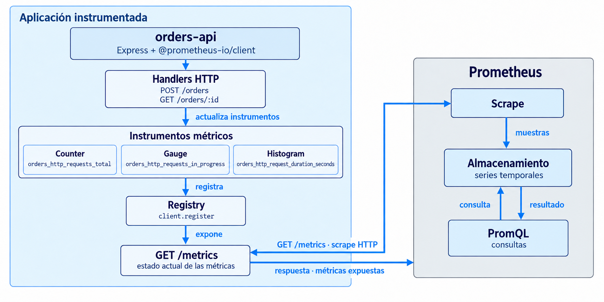
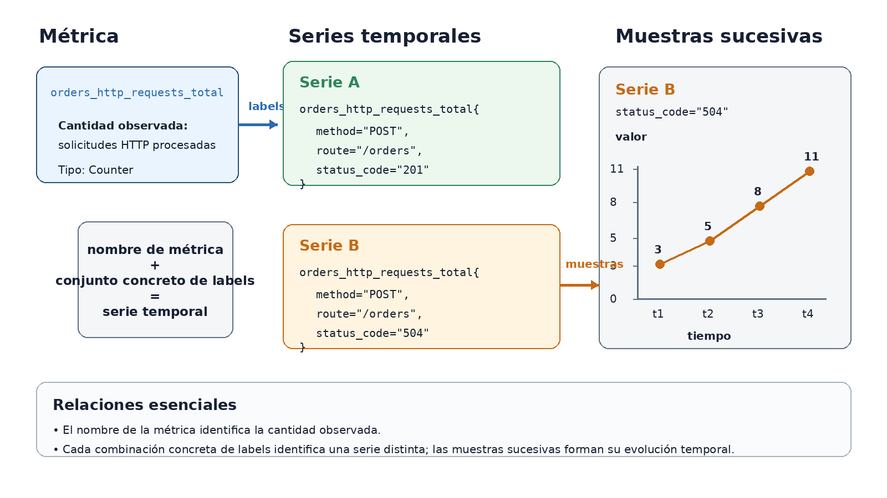
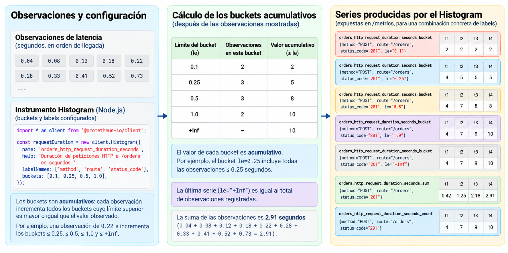

<!--
Requiere en MkDocs Material:
- admonition
- attr_list
- md_in_html
- pymdownx.details
- pymdownx.superfences
- pymdownx.tabbed:
    alternate_style: true
-->

# 3.3 Prometheus e instrumentación de métricas

## Objetivos de aprendizaje

Al finalizar la sesión se espera que el estudiante pueda:

- Explicar la función de Prometheus dentro de un sistema de observabilidad;
- Explicar cómo una aplicación instrumentada expone métricas y cómo Prometheus las recolecta;
- Seleccionar `Counter`, `Gauge` o `Histogram` de acuerdo con la cantidad que debe representarse;
- Instrumentar un servicio Express mediante el cliente oficial de Prometheus para Node.js;
- Comprobar que las métricas expuestas por la aplicación son recolectadas por Prometheus.

!!! question "Pregunta central"

    **¿Cómo instrumentar un servicio para obtener evidencia cuantitativa sobre su actividad, su estado y la distribución de sus tiempos de respuesta?**


## 1. Prometheus: modelo de datos y recolección

### 1.1 Función de Prometheus

En la primera clase de esta unidad (3.1) se introdujeron métricas, logs y trazas como señales de telemetría. En la clase anterior (3.2) se instrumentó `orders-api` para producir logs estructurados. Esta sesión aborda la producción, exposición y recolección de métricas.

**Prometheus** es un sistema de monitoreo y alertamiento basado en métricas. Recolecta métricas de aplicaciones y sistemas instrumentados, almacena sus valores como series temporales y permite consultarlos mediante PromQL.

En la arquitectura utilizada en esta clase, `orders-api` mantiene instrumentos métricos dentro del proceso. El endpoint `/metrics` expone su estado actual. Prometheus consulta periódicamente ese endpoint, almacena las muestras obtenidas y permite recuperar las series mediante consultas.

<figure markdown="span">
  { width="100%" }
  <figcaption>Figura 1. Arquitectura de instrumentación y recolección. `orders-api` actualiza instrumentos registrados por la biblioteca cliente; `/metrics` expone su estado actual y Prometheus recolecta muestras mediante scrapes periódicos para almacenarlas como series temporales.</figcaption>
</figure>

La instrumentación se incorpora en la aplicación mediante una biblioteca cliente. En esta práctica se utilizará:

```text
@prometheus-io/client
```

La biblioteca proporciona los instrumentos, mantiene su estado y genera la representación que la aplicación expone por HTTP.

### 1.2 Métricas, labels, muestras y series temporales

Una **métrica** describe una cantidad que se desea observar. En el modelo de Prometheus, el nombre identifica esa cantidad y los labels distinguen series asociadas con diferentes dimensiones.

Por ejemplo:

```text
orders_http_requests_total
```

describe el número acumulado de solicitudes HTTP procesadas.

Un **label** es una dimensión expresada mediante un par nombre-valor. Por ejemplo:

```text
method="POST"
route="/orders"
status_code="504"
```

La combinación del nombre de la métrica y un conjunto concreto de labels identifica una **serie temporal**:

```text
orders_http_requests_total{
  method="POST",
  route="/orders",
  status_code="504"
}
```

Una **muestra** contiene el valor observado para esa serie en un instante determinado. Una serie temporal está formada por la sucesión de esas muestras.

<figure markdown="span">
  { width="100%" }
  <figcaption>Figura 2. Relación entre métrica, labels, serie temporal y muestras. Los valores 3, 5, 8 y 11 son datos didácticos utilizados para representar la evolución de una serie asociada con `status_code="504"`.</figcaption>
</figure>

Dos series pueden compartir el mismo nombre de métrica y diferenciarse por sus labels:

```text
orders_http_requests_total{
  method="POST",
  route="/orders",
  status_code="201"
}
```

```text
orders_http_requests_total{
  method="POST",
  route="/orders",
  status_code="504"
}
```

Durante un scrape ordinario, Prometheus obtiene los valores expuestos por la aplicación y registra el instante de recolección. El endpoint `/metrics` presenta el estado actual de los instrumentos; el histórico se obtiene en Prometheus mediante scrapes sucesivos.

Esta distinción será necesaria posteriormente para interpretar qué evidencia se encuentra en la aplicación y cuál se conserva como serie temporal.

### 1.3 Exposición, targets y scraping

**Exponer métricas** significa presentar el estado actual de los instrumentos en un formato que Prometheus pueda interpretar. Una convención habitual es utilizar:

```text
GET /metrics
```

Una respuesta puede contener:

```text
# HELP orders_http_requests_total Total number of HTTP requests processed.
# TYPE orders_http_requests_total counter
orders_http_requests_total{method="POST",route="/orders",status_code="201"} 12
orders_http_requests_total{method="POST",route="/orders",status_code="504"} 3
```

| Elemento | Función |
|---|---|
| `# HELP` | describe la métrica |
| `# TYPE` | declara el tipo de métrica |
| nombre | identifica la cantidad |
| labels | distinguen dimensiones |
| valor | contiene el valor expuesto |

Un **target** es una instancia o endpoint desde el cual Prometheus obtiene métricas. La consulta periódica de ese target se denomina **scrape**. En esta práctica, Prometheus opera con un modelo de recolección *pull*: inicia una solicitud HTTP hacia `/metrics` y recibe como respuesta las métricas expuestas.

Si entre dos scrapes ocurren varias solicitudes HTTP, la aplicación actualiza internamente sus instrumentos. En el siguiente scrape Prometheus obtiene los valores que esos instrumentos presentan en ese momento.

Un **job** agrupa targets relacionados dentro de la configuración de Prometheus:

```yaml
global:
  scrape_interval: 5s

scrape_configs:
  - job_name: orders-api
    static_configs:
      - targets:
          - orders-api:3000
```

En esta práctica, el intervalo de cinco segundos facilita la observación durante la clase. En un sistema real, el intervalo se selecciona considerando la resolución requerida, el costo de recolección y las características del servicio.

**PromQL** es el lenguaje de consulta de Prometheus. En esta sesión se utilizarán únicamente selectores simples para comprobar que las series existen. Las tasas, ventanas temporales, agregaciones y cuantiles se estudiarán en 3.4.

## 2. Tipos de métricas

El tipo de métrica se selecciona de acuerdo con el comportamiento de la cantidad representada.

| Tipo | Definición | Aplicación en `orders-api` |
|---|---|---|
| `Counter` | cantidad acumulativa monotónica entre reinicios | solicitudes procesadas |
| `Gauge` | valor actual de una cantidad que puede aumentar o disminuir | solicitudes en ejecución |
| `Histogram` | distribución de observaciones agrupadas mediante límites acumulativos | duración de solicitudes |

### 2.1 Counter

Un `Counter` representa una cantidad acumulativa cuyo valor aumenta durante la ejecución normal del proceso. Un reinicio del proceso o de la métrica puede reiniciar su valor.

```text
proceso A
0 -> 20 -> 43 -> 71

reinicio

proceso B
0 -> 4 -> 17
```

En `orders-api`, la métrica:

```text
orders_http_requests_total
```

representa el número acumulado de solicitudes procesadas.

```js
const requestsTotal = new client.Counter({
  name: "orders_http_requests_total",
  help: "Total number of HTTP requests processed.",
  labelNames: ["method", "route", "status_code"]
});
```

Una actualización puede realizarse así:

```js
requestsTotal.inc({
  method: "POST",
  route: "/orders",
  status_code: "201"
});
```

!!! warning "Counter y tasa"

    Un counter expone un acumulado. El cálculo de una tasa requiere comparar muestras obtenidas en diferentes instantes.

    `rate()` e `increase()` se estudiarán en 3.4.

### 2.2 Gauge

Un `Gauge` representa el valor actual de una cantidad que puede aumentar, disminuir o establecerse directamente.

Operaciones típicas:

```js
gauge.inc();
gauge.dec();
gauge.set(27);
```

En `orders-api`:

```text
orders_http_requests_in_progress
```

representa el número de solicitudes que se encuentran en ejecución.

```js
const requestsInProgress = new client.Gauge({
  name: "orders_http_requests_in_progress",
  help: "HTTP requests currently being processed.",
  labelNames: ["route"]
});
```

Para esta cantidad se utiliza incremento al iniciar una solicitud y decremento al finalizarla:

```js
requestsInProgress.inc({ route: "/orders" });

// procesamiento

requestsInProgress.dec({ route: "/orders" });
```

Durante solicitudes concurrentes, el valor puede evolucionar de la siguiente forma:

```text
0 -> 1 -> 2 -> 1 -> 0
```

El valor `0` indica que, en el instante observado, no existen solicitudes activas.

### 2.3 Histogram

Un `Histogram` registra observaciones numéricas y conserva información sobre su distribución mediante buckets acumulativos, una suma y un contador de observaciones.

Para `orders-api` se utilizará:

```text
orders_http_request_duration_seconds
```

con duración expresada en segundos:

```js
const requestDuration = new client.Histogram({
  name: "orders_http_request_duration_seconds",
  help: "Duration of HTTP requests in seconds.",
  labelNames: ["method", "route", "status_code"],
  buckets: [0.05, 0.1, 0.25, 0.5, 1, 2]
});
```

Un **bucket** cuenta cuántas observaciones son menores o iguales que un límite superior. En un histogram clásico de Prometheus, el límite se expresa mediante el label especial `le`, abreviatura de *less than or equal*.

Por ejemplo:

```text
le="0.5"
```

representa observaciones con:

\[
x \leq 0.5 \text{ s}
\]

Si se registra una duración de:

```text
0.35 s
```

se incrementan los buckets:

```text
le="0.5"
le="1"
le="2"
le="+Inf"
```

y también se actualizan:

```text
_count
_sum
```

La Figura 3 utiliza una configuración didáctica reducida de buckets:

```text
[0.1, 0.25, 0.5, 1.0]
```

para hacer visible el cálculo acumulativo. El histogram de la práctica utiliza además los límites `0.05` y `2` segundos.

<figure markdown="span">
  { width="100%" }
  <figcaption>Figura 3. Acumulación de observaciones en un histogram clásico. Los valores mostrados son datos didácticos; cada bucket expuesto contiene todas las observaciones menores o iguales que su límite superior, mientras `_count` y `_sum` registran respectivamente el número y la suma de las observaciones.</figcaption>
</figure>

En la tabla central de la figura, la columna **“Observaciones en este bucket”** separa los datos por intervalos únicamente para mostrar cómo se forma el acumulado. El valor que corresponde a una serie `_bucket` de Prometheus es el de la columna **“Valor acumulativo”**.

La exposición de un histogram clásico contiene series como:

```text
orders_http_request_duration_seconds_bucket{le="0.05",...}
orders_http_request_duration_seconds_bucket{le="0.1",...}
orders_http_request_duration_seconds_bucket{le="0.25",...}
orders_http_request_duration_seconds_bucket{le="0.5",...}
orders_http_request_duration_seconds_bucket{le="1",...}
orders_http_request_duration_seconds_bucket{le="2",...}
orders_http_request_duration_seconds_bucket{le="+Inf",...}

orders_http_request_duration_seconds_sum{...}
orders_http_request_duration_seconds_count{...}
```

Este conjunto de series relacionadas forma la familia del histogram. `_count` registra el número total de observaciones y `_sum` la suma de los valores observados.

Los buckets permitirán estimar posteriormente cuantiles como p50, p95 o p99. El cálculo y la interpretación de esos cuantiles se estudiarán en 3.4.

??? info "Histograms clásicos y nativos"

    Prometheus dispone también de native histograms. En esta clase se utilizará un histogram clásico para hacer explícitos los buckets, `_sum`, `_count` y su efecto sobre el número de series.

## 3. Diseño de métricas y cardinalidad

El diseño de una métrica requiere definir la cantidad observada, el tipo, el nombre, la unidad y las dimensiones que deben conservarse como labels.

### 3.1 Selección de labels

Los labels deben corresponder con dimensiones necesarias para analizar la cantidad.

Para solicitudes HTTP se utilizarán `method`, `route` y `status_code`.

Ejemplo:

```text
orders_http_requests_total{
  method="POST",
  route="/orders",
  status_code="504"
}
```

Valores como `request_id`, `order_id` o `customer_email` presentan una variabilidad mucho mayor. Incorporarlos como labels puede producir una cantidad de series proporcional al número de solicitudes, órdenes o usuarios observados.

Para una solicitud:

```text
GET /orders/ord-1002
```

el label de ruta debe representar la operación lógica:

```text
route="/orders/:id"
```

De esta manera, diferentes órdenes permanecen agrupadas dentro de la misma dimensión `route`.

### 3.2 Cardinalidad

La **cardinalidad** es el número de series temporales distintas producidas por las combinaciones de valores de labels.

Supóngase una métrica con:

```text
method       = 2 valores
route        = 2 valores
status_code  = 3 valores
```

El número máximo de combinaciones es:

\[
2 \times 2 \times 3 = 12
\]

Un counter podría producir hasta 12 series para esas combinaciones.

En un histogram clásico con seis límites explícitos se exponen, para cada combinación de labels:

```text
6 buckets configurados
+ bucket +Inf
+ _sum
+ _count
= 9 series
```

Si las 12 combinaciones se materializan:

\[
12 \times 9 = 108
\]

series pueden corresponder a una única familia de histogram.

!!! danger "Cardinalidad"

    El costo de una dimensión depende del número de valores que puede asumir y de las combinaciones que genera con los demás labels. Los identificadores de alta variabilidad deben evitarse como dimensiones de métricas salvo que exista una justificación técnica específica.

### 3.3 Nombres y unidades

Las métricas de la práctica son:

```text
orders_http_requests_total
orders_http_requests_in_progress
orders_http_request_duration_seconds
```

Los nombres reflejan varias decisiones:

- `orders_` identifica métricas específicas de la aplicación;
- las duraciones se expresan en segundos;
- los counters utilizan el sufijo `_total`;
- cada familia mantiene una cantidad y una unidad coherentes.

Los códigos HTTP forman parte de una dimensión:

```text
orders_http_requests_total{status_code="201"}
orders_http_requests_total{status_code="504"}
```

La misma cantidad se conserva bajo un único nombre y se separa mediante labels.

??? info "Métricas del runtime"

    El **runtime** es el entorno de ejecución del proceso. En Node.js incluye, entre otros aspectos, memoria administrada, event loop y garbage collection.

    El cliente puede registrar métricas del runtime mediante:

    ```js
    client.collectDefaultMetrics();
    ```

    Estas métricas complementan las métricas de aplicación definidas específicamente para `orders-api`.

## 4. Instrumentación de `orders-api`

La práctica utiliza Node.js, Express, `@prometheus-io/client`, Prometheus y Docker Compose. El repositorio contiene el servicio, la configuración de Prometheus, generadores de tráfico y validadores para la parte guiada y la actividad.

[Repositorio de práctica](https://github.com/guillermocalderon2021/3.3-Prometheus){ .md-button .md-button--primary }

### 4.1 Preparación del entorno

El repositorio requiere Node.js 22 o posterior y Docker con Docker Compose. Las dependencias de la aplicación se instalan dentro de la imagen Docker; no es necesario ejecutar `npm install` en el sistema anfitrión.

```text
git clone https://github.com/guillermocalderon2021/3.3-Prometheus
cd 3.3-Prometheus
npm run doctor
docker compose up --build -d
```

El diagnóstico debe terminar con:

```text
RESULTADO: ENTORNO LISTO
```

La aplicación queda disponible en:

```text
http://localhost:3000
```

y Prometheus en:

```text
http://localhost:9090
```

El endpoint:

```text
http://localhost:3000/health
```

debe responder:

```json
{"status":"ok"}
```

En Prometheus, el target correspondiente al job `orders-api` debe aparecer con estado:

```text
UP
```

El código de `src/` está montado en el contenedor y Node.js se ejecuta en modo `--watch`. Si un cambio local no se refleja automáticamente, puede reiniciarse únicamente la aplicación:

```text
docker compose restart orders-api
```

### 4.2 Biblioteca cliente, registry e instrumentos

El proyecto utiliza módulos ES:

```js
import * as client from "@prometheus-io/client";
```

En `src/metrics.js` se definen las tres familias:

```js
export const requestsTotal = new client.Counter({
  name: "orders_http_requests_total",
  help: "Total number of HTTP requests processed.",
  labelNames: ["method", "route", "status_code"]
});

export const requestsInProgress = new client.Gauge({
  name: "orders_http_requests_in_progress",
  help: "HTTP requests currently being processed.",
  labelNames: ["route"]
});

export const requestDuration = new client.Histogram({
  name: "orders_http_request_duration_seconds",
  help: "Duration of HTTP requests in seconds.",
  labelNames: ["method", "route", "status_code"],
  buckets: [0.05, 0.1, 0.25, 0.5, 1, 2]
});
```

Un **registry** mantiene el conjunto de métricas que la aplicación expone. El proyecto utiliza el registry global:

```js
export const register = client.register;
```

En `src/server.js`, `/metrics` serializa su estado:

```js
app.get("/metrics", async (_req, res, next) => {
  try {
    res.set("Content-Type", register.contentType);
    res.end(await register.metrics());
  } catch (error) {
    next(error);
  }
});
```

### 4.3 Instrumentación guiada de `POST /orders`

El archivo que se modifica durante la parte guiada es:

```text
src/orders.js
```

La operación posee tres resultados controlados relevantes para el escenario:

| Escenario | Duración aproximada | Respuesta | Primer bucket que lo contiene |
|---|---:|---:|---:|
| `normal` | 0.08 s | 201 | `le="0.1"` |
| `slow` | 0.35 s | 201 | `le="0.5"` |
| `payment-timeout` | 0.70 s | 504 | `le="1"` |

Además, un escenario desconocido produce `400`. La instrumentación debe cubrir todos los caminos controlados del handler.

El patrón utilizado es:

```js
const route = "/orders";

requestsInProgress.inc({ route });

const endTimer = requestDuration.startTimer({
  method: req.method,
  route
});

try {
  // Toda la lógica de POST /orders permanece dentro de este bloque.
  // Sus respuestas controladas pueden terminar con 400, 504 o 201.
} finally {
  const statusCode = String(res.statusCode);

  requestsTotal.inc({
    method: req.method,
    route,
    status_code: statusCode
  });

  requestsInProgress.dec({ route });

  endTimer({
    status_code: statusCode
  });
}
```

`method` y `route` se conocen al iniciar la solicitud. `status_code` se incorpora al finalizar, cuando el resultado HTTP ya está determinado. El bloque `finally` permite ejecutar la actualización de los instrumentos en todos los caminos controlados del handler.

El `Gauge` se incrementa antes del procesamiento y se decrementa al finalizar. El `Counter` registra una solicitud completada. El `Histogram` conserva una observación de duración y la asocia con el resultado HTTP.

### 4.4 Producción de evidencia en la parte guiada

Después de completar la instrumentación, el escenario controlado se ejecuta con:

```text
npm run guided
```

El generador produce:

```text
12 normal
5 slow
3 payment-timeout
```

y debe terminar con:

```text
201: 17
504: 3
total: 20
```

!!! warning "Datos didácticos"

    Los tiempos y cantidades de solicitudes se introducen para estudiar la instrumentación. No constituyen benchmarks de Node.js, Express ni Prometheus.

Para inspeccionar únicamente las familias `orders_*` expuestas por la aplicación:

```text
npm run metrics
```

El resultado debe incluir series de `POST /orders` para `201` y `504`, además de las series del histogram.

El `Gauge` requiere una observación durante concurrencia. Para generar cinco solicitudes lentas simultáneas:

```text
npm run concurrent
```

Durante el procesamiento debe observarse un valor mayor que cero y, una vez completadas las solicitudes, el gauge debe volver a:

```text
0
```

Esta diferencia permite separar dos preguntas: el `Counter` responde cuántas solicitudes se han procesado; el `Gauge` representa cuántas se encuentran activas en el instante observado.

### 4.5 Verificación de exposición y recolección

La comprobación se realiza en tres niveles.

**Exposición de la aplicación**

```text
http://localhost:3000/metrics
```

o:

```text
npm run metrics
```

muestra el estado que la aplicación expone.

**Recolección**

Prometheus debe mostrar el target `orders-api` con estado:

```text
UP
```

Un estado `DOWN` indica que la recolección no pudo completarse. La causa puede encontrarse en conectividad, resolución de nombre, puerto, ruta o disponibilidad de la aplicación.

**Series almacenadas**

En Prometheus pueden utilizarse selectores simples:

```text
orders_http_requests_total
```

```text
orders_http_requests_in_progress
```

```text
orders_http_request_duration_seconds_count
```

La validación automatizada de la parte guiada se ejecuta mediante:

```text
npm run check:guided
```

El resultado esperado es:

```text
RESULTADO: INSTRUMENTACIÓN GUIADA COMPLETA
```

La validación comprueba tanto la exposición de las métricas como la existencia de series recolectadas por Prometheus.

## 5. Actividad práctica: `GET /orders/:id`

La actividad aplica los criterios anteriores a una segunda operación ya implementada. El archivo que se modifica continúa siendo:

```text
src/orders.js
```

Antes de comenzar debe verificarse la parte guiada:

```text
npm run check:guided
```

El resultado debe confirmar:

```text
RESULTADO: INSTRUMENTACIÓN GUIADA COMPLETA
```

### 5.1 Trabajo requerido

Instrumente `getOrder()` para que `GET /orders/:id` utilice las familias existentes:

```text
orders_http_requests_total
orders_http_requests_in_progress
orders_http_request_duration_seconds
```

Debe decidir qué valores utilizar para los labels definidos por cada familia. La dimensión `route` debe representar la operación HTTP de manera estable y evitar una serie distinta para cada identificador de orden.

No deben modificarse:

```text
src/metrics.js
prometheus/prometheus.yml
scripts/
```

### 5.2 Generación de tráfico y evidencia esperada

Ejecute:

```text
npm run activity
```

El escenario realiza doce solicitudes deterministas:

```text
200: 8
404: 4
total: 12
```

Después inspeccione las métricas:

```text
npm run metrics
```

La implementación debe producir series correspondientes a la operación lógica y permitir distinguir los códigos de respuesta observados. Deben poder encontrarse combinaciones equivalentes a:

```text
method="GET"
route="/orders/:id"
status_code="200"
```

y:

```text
method="GET"
route="/orders/:id"
status_code="404"
```

El valor concreto de `id` no debe aparecer como valor de `route`. Por ejemplo:

```text
route="/orders/ord-1001"
```

introduciría una dimensión cuya cardinalidad crece con los identificadores observados.

### 5.3 Validación

Ejecute:

```text
npm run check:activity
```

La actividad está técnicamente completa cuando el validador muestra:

```text
RESULTADO: ACTIVIDAD COMPLETA
```

El validador comprueba la existencia de las series de `GET`, los códigos `200` y `404`, el histogram, el gauge y la ausencia de identificadores concretos de orden en el label `route`.

### 5.4 Análisis

La actividad se considera completa cuando pueden justificarse técnicamente las siguientes decisiones:

1. selección del valor utilizado en el label `route`;
2. uso de `Counter` para solicitudes procesadas;
3. uso de `Gauge` para solicitudes activas;
4. uso de `Histogram` para duración;
5. dimensiones conservadas como labels y dimensiones descartadas;
6. diferencia entre el valor expuesto en `/metrics` y la serie almacenada por Prometheus;
7. información temporal adicional que será necesaria para calcular una tasa.

### 5.5 Criterios de revisión

| Criterio | Comprobación |
|---|---|
| Cantidad | la métrica representa una cantidad o estado claramente definido |
| Tipo | el tipo corresponde con el comportamiento de la cantidad |
| Unidad | la unidad es consistente y aparece en el nombre cuando corresponde |
| Labels | cada dimensión responde una necesidad de análisis |
| Cardinalidad | las dimensiones mantienen un conjunto de valores controlado |
| Ruta | se representa la operación lógica, no una URL concreta |
| Actualización | los caminos controlados actualizan las métricas |
| Exposición | las métricas aparecen en `/metrics` |
| Scraping | Prometheus puede recolectarlas |
| Interpretación | se distingue entre exposición actual, muestra y serie temporal |

## 6. Qué evidencia se obtuvo

Al finalizar la sesión, `orders-api` produce tres formas complementarias de evidencia cuantitativa:

| Pregunta | Evidencia |
|---|---|
| ¿Cuántas solicitudes se han procesado por operación y resultado? | `orders_http_requests_total` |
| ¿Cuántas solicitudes se encuentran activas en este instante? | `orders_http_requests_in_progress` |
| ¿Cómo se distribuyen las duraciones observadas? | `orders_http_request_duration_seconds` |

Estas métricas permiten describir actividad, estado y distribución de tiempos, pero todavía no responden directamente preguntas como solicitudes por segundo, evolución durante una ventana temporal o p95 de latencia. Para esas preguntas se necesitan operaciones sobre series temporales. Ese análisis corresponde a 3.4, donde se introducirán selectores temporales, `rate()`, `increase()`, agregaciones y cuantiles.

## Referencias

- Prometheus. [Overview](https://prometheus.io/docs/introduction/overview/).
- Prometheus. [Data model](https://prometheus.io/docs/concepts/data_model/).
- Prometheus. [Instrumentation](https://prometheus.io/docs/practices/instrumentation/).
- Prometheus. [Metric and label naming](https://prometheus.io/docs/practices/naming/).
- Prometheus. [Exposition formats](https://prometheus.io/docs/instrumenting/exposition_formats/).
- Prometheus. [Metric types](https://prometheus.io/docs/concepts/metric_types/).
- Prometheus. [Histograms and summaries](https://prometheus.io/docs/practices/histograms/).
- Prometheus. [Configuration](https://prometheus.io/docs/prometheus/latest/configuration/configuration/).
- Prometheus. [`client_js`: cliente oficial para Node.js](https://github.com/prometheus/client_js).
